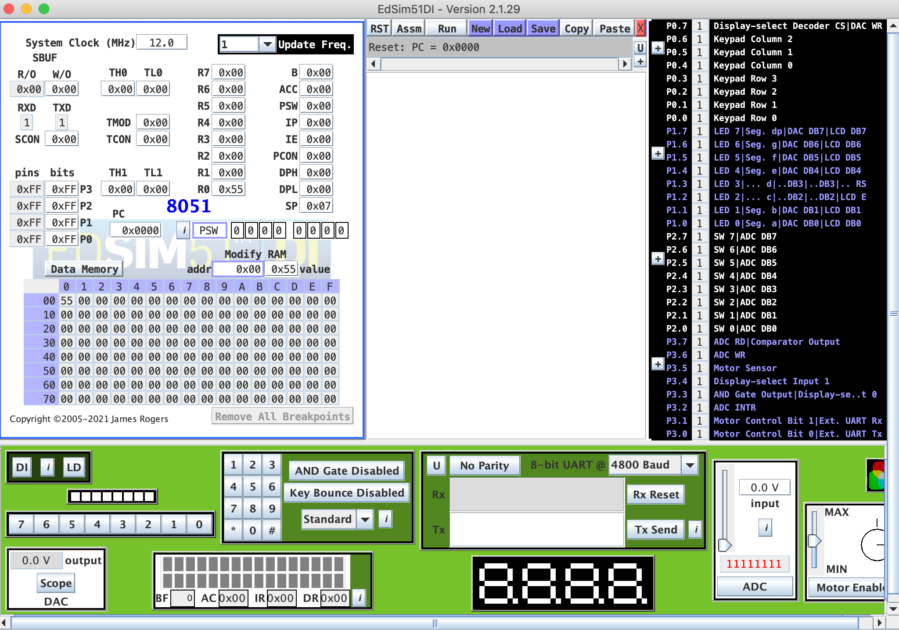

# Assembly com o microprocessador 8051 (modelo AT89S51)
Projeto que tem a finalidade de servir como estudo da linguagem Assembly junto com o microprocessador 8501.

**Disclaimer:** O estudo desse projeto se destina a desenvolvedores/programadores que NÃO são iniciantes em programação, porém, desejam aprender assembly de forma gradativa através de pequenos programas. 

## IDE e Simulador 
Para fins de estudos, a programação e simulação dos códigos iremos utilizador o simulador **edsim51di**, que pode ser encontrado para download no seguinte link:  

[https://www.edsim51.com/](https://www.edsim51.com/)  
[https://www.edsim51.com/8051simulator/edsim51di.zip](https://www.edsim51.com/8051simulator/edsim51di.zip)  

**Observação-1:** O simulador foi desenvolvido em java, sendo assim possível de ser utilizado em qualquer sistema operacional.  
**Observação-2:** Para executar o simulador, rode o seguinte comando no terminal:
```shell
java -jar edsim51di.jar
```
A tela do simulador edsim51di é demonstrada na imagem abaixo:  


## HARDWARE
Para entendermos um pouco mais do hardware dos microprocessadores standard 8051, iremos tomar o circuito integrado do modelo **AT89S51**. Algumas características desse modelo são:  
- Memória flash: 4K Bytes
- Faixa de tensão: 4 a 5.5 volts
- Memória RAM interna: 128 x 8 bit
- I/O's programáveis: 32 portas
- Contadores/Timers: 2 x 16 bit
- Canal de comunicação: Full duplex UART

Caso queira saber mais detalhes sobre a especificação do AT89S51, dê uma lida no datasheet que se encontra disponível no arquivo a seguir: 

 [Datasheet AT89S51](datasheet_at89s51.pdf)

## SOFTWARE
Desse ponto em diante, iremos começar a codificar e simular os scripts para ver qual o comportamento do microprocessador 8501. Cada programa desenvolvido irá ficar registrado na pasta raíz desse projeto com a extensão .asm no final. Caso queira, importar o programa para o simulador, siga os passos abaixo:  
```
Simulador > Load > Selecione o arquivo .asm desejado > Open.
```
Caso contrário, clique em `New` para iniciar um novo programa.


## Programas
Todos os programas que serão desenvolvidos nesse projeto estarão comentados liha por linha afim de demonstrar a sintaxe da linguagem Assembly e o que faz cada keyword.

### PROGRAMA-1:  (program1.asm)
Esse programa apenas atribui algumas váriáveis hexadecimais para os pinos de I/0 a, r0 e b. 
```Assembly
; PROGRAMA - 1: Programa que tem o intuito de demostrar como é comentário, função e atribuição 
; de valores hexadecimais para acumuladores e registradores

org 00h				; Origem no endereço 00
inicio: 			; Nome de função
	mov a, #0ffh	; Move o valor hexadecimal ff para o acumulador a
	mov a, #000h	; Move o valor hexadecimal 00 para o acumulador a
	mov r0, #055h 	; Move o valor hexadecimal 55 para o registrador r0
	mov b,	#0aah	; Move o valor hexadecimal aa para o registrador b
	jmp $			; Segura o programa nessa linha
end					; Finaliza o programa%
```
### PROGRAMA-2: (program2.asm)
Esse programa funciona como um blink (pisca-pisca), onde fica ligando e desligando a porta r0.
```asm
; PROGRAMA - 2: Programa que tem o intuito de demonstrar como é um loop infinito

org 00h				    ; Origem no endereço de memória 0
inicio:                 ; Nome de função
	mov 	r0, #00h	; Coloca o pino r0 em estado low
	mov 	r0, #0ffh	; Coloca o pino r0 em estado high
	jmp	inicio		    ; Pula para a função inicio e recomeça tudo, formando um loop infinito
end				        ; Finaliza o programa
```